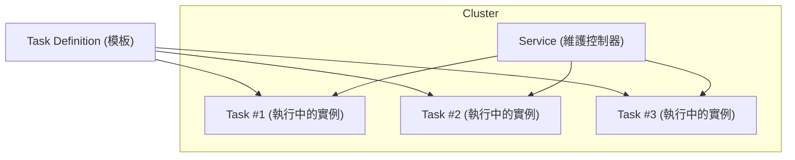

# ECS Demo 專案

這個專案包含兩個簡單的 Flask API 服務，用於 ECS 實驗。

## 服務說明

1. **Hello 服務** - 運行在端口 5000
   - 提供 `/hello` 端點，回傳 "hello"
   - 提供 `/test` 端點，會呼叫 World 服務並回傳 "hello world"

2. **World 服務** - 運行在端口 5001
   - 提供 `/world` 端點，回傳 "world"
   - 提供 `/test` 端點，會呼叫 Hello 服務並回傳 "world hello"

## 如何運行

使用 Docker Compose 啟動服務：

```bash
docker-compose up
```

## 測試 API

1. 測試 Hello 服務：
   ```bash
   curl http://localhost:5000/hello
   ```
   預期回應：`hello`

2. 測試 World 服務：
   ```bash
   curl http://localhost:5001/world
   ```
   預期回應：`world`

3. 測試 test 服務：
   ```bash
   curl http://localhost:5000/test

   curl http://localhost:5001/test
   ```

## 手動部署到 ECS

這個專案設計為可以輕鬆部署到 AWS ECS。您需要：

1. 將 Docker 映像推送到 ECR
2. 創建 ECS 任務定義
3. 設置 ECS 服務和叢集

具體部署步驟將依據您的 AWS 環境而定。

另寫了 terraform 版本
1. terraform init
2. terraform apply



